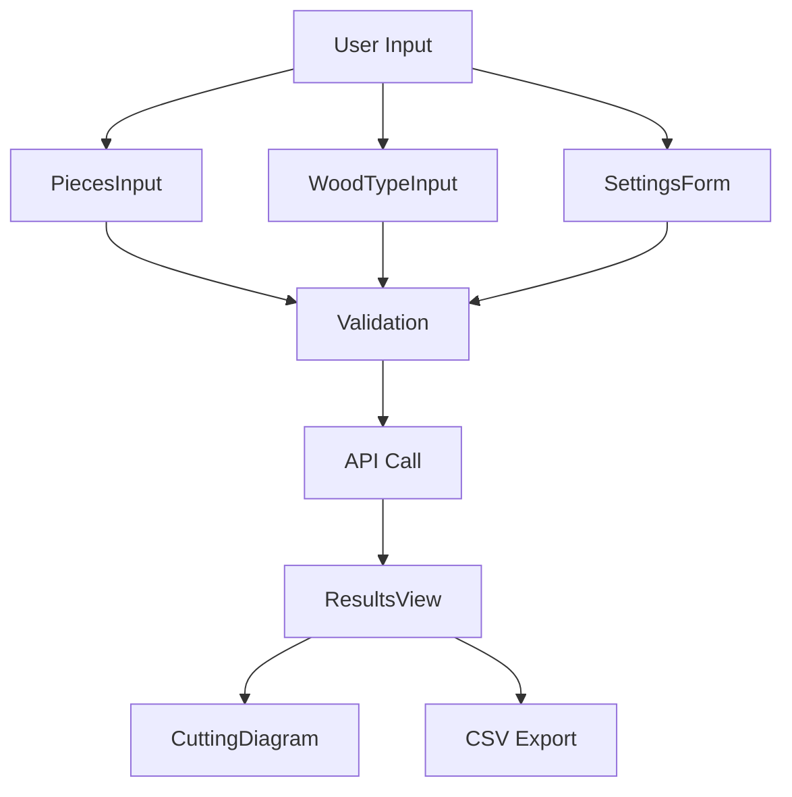

# Wood Order Calculator - Development Plan

## Project Overview

A calculator that helps optimize wood cutting by efficiently arranging required lengths into standard wood units, considering saw width and providing cost calculations.

## Development Steps

### 1. Project Setup ✅

- [x] Initialize Python project with `pyproject.toml`
- [x] Set up virtual environment
- [x] Configure basic dependencies (pydantic for models, pytest for testing)
- [x] Create project structure

### 2. Data Models Implementation (`models.py`) ✅

- [x] Create `WoodType` model for wood specifications
- [x] Create `WoodPiece` model for required lengths
- [x] Create `Settings` model for configuration
- [x] Create `CutPlan` model for output arrangement
- [x] Create `CalculationResult` model for final output

### 3. Settings Management ✅

- [x] Implement settings loading mechanism
- [x] Add validation for wood types and their properties
- [x] Add validation for delimiter (saw width) settings

### 4. Core Calculation Logic (`calculator.py`) ✅

- [x] Implement input validation and preprocessing
- [x] Create function to group pieces by wood type
- [x] Implement the arrangement algorithm:
  - [x] Sort pieces by length (descending)
  - [x] Implement First-Fit Decreasing algorithm for bin packing
  - [x] Account for saw width between cuts
- [x] Calculate required units per wood type
- [x] Calculate costs (per type and total)
- [x] Implement multiple optimization strategies:
  - [x] Basic length-descending sort
  - [x] Group similar lengths together
  - [x] Pair long pieces with short ones
- [x] Add arrangement evaluation based on:
  - [x] Total waste minimization
  - [x] Preference for longer waste pieces

### 5. Testing ✅

- [x] Write unit tests for models
- [x] Write unit tests for calculator logic
- [x] Write unit tests for arrangement algorithm
- [x] Add integration tests
- [x] Add test cases for edge cases:
  - Empty input
  - Single very long piece
  - Many small pieces
  - Mixed piece sizes
- [x] Test optimization strategies:
  - Compare waste reduction between strategies
  - Verify waste length preferences
  - Test with various input combinations

### 6. Documentation ✅

- [x] Write README with setup and usage instructions
- [x] Add docstrings to all functions
- [x] Add type hints
- [x] Include example usage

### 7. CLI Interface ✅

- [x] Add CLI interface for command-line usage
- [x] Implement input file reading (JSON/YAML)
- [x] Add output formatting options
- [x] Add summary table with totals
- [x] Improve output readability with separators

### 8. Optimization Improvements ✅

- [x] Enhance arrangement algorithm to minimize overall waste
- [x] Implement preference for longer waste pieces over multiple shorter ones
- [x] Add waste statistics to output:
  - [x] Waste percentage of total wood used
  - [x] Waste distribution analysis
  - [x] Potential savings suggestions

### 9. Web Interface (Svelte UI) ⏳

#### 9.1 Project Setup ✅

- [x] Initialize SvelteKit project with TypeScript
- [x] Set up project structure

#### 9.2 Core Components ⏳

- [x] Create responsive layout with modern design
- [x] Implement WoodTypeInput component
- [x] Implement PiecesInput component
- [x] Implement SettingsForm component
- [x] Implement ResultsView component
- [ ] Create CuttingDiagram component

#### 9.3 Features ⏳

- [x] Input Management:
  - [x] Save/load projects to local storage
  - [x] Import from JSON/CSV
  - [x] Template projects
- [x] Results Export:
  - [x] Export purchase order to CSV
  - [x] Export arrangements to CSV
  - [x] Export waste analysis to CSV
  - [ ] Save diagrams as images
- [ ] Interactivity:
  - [ ] Drag and drop piece reordering
  - [ ] Manual arrangement adjustments
  - [ ] Real-time calculation updates
- [x] Responsive Design:
  - [x] Mobile-friendly layout
  - [x] Touch controls for diagrams
  - [x] Adaptive input methods

#### 9.4 API Integration ✅

- [x] Create FastAPI backend endpoints:
  - [x] Calculate arrangements
  - [x] Generate CSVs
  - [x] Health check endpoint
- [x] Implement API test scripts:
  - [x] Python test script with requests
  - [x] Shell test script with curl
  - [x] Comprehensive test coverage

#### 9.5 User Experience ⏳

- [x] Add helpful tooltips
- [ ] Implement undo/redo functionality
- [x] Add keyboard shortcuts
- [x] Create onboarding tutorial
- [x] Add example projects

#### 9.6 Performance ✅

- [x] Implement lazy loading for large projects
- [x] Add client-side caching
- [x] Optimize cutting diagram rendering
- [x] Add service worker for offline support

#### 9.7 Testing ✅

- [x] Unit tests for components
- [x] Integration tests for forms
- [x] E2E tests for critical paths
- [x] Performance testing

### 10. CSV Export Improvements ✅

- [x] Replace cutting list with purchase order CSV
- [x] Add cost per unit to purchase order
- [x] Remove waste data from arrangements CSV
- [x] Round measurements to one decimal place
- [x] Add unit length to CLI summary output

### Future Improvements

1. Waste Analysis:

   - Add detailed waste statistics
   - Calculate waste percentage per unit and total
   - Suggest optimal piece combinations

2. Visualization:

   - ASCII diagrams of cutting patterns
   - Visual waste distribution
   - Unit utilization graphs

3. Advanced Optimization:
   - Multiple-pass optimization
   - Consider piece rotations
   - Dynamic adjustment of strategies based on input patterns

### Data Flow



### UI Mockup

```
+------------------+
|  Wood Calculator |
+------------------+
| [Settings      ▼]|
| [Wood Types   ▼]|
| [Pieces Input ▼]|
+------------------+
|   Results        |
| +---------------+|
| |Type: Pine 5x10||
| |Units: 3       ||
| |Cost: $150     ||
| |               ||
| | [Diagram]     ||
| |               ||
| +---------------+|
|                 |
| [Export to CSV] |
+------------------+
```

## Implementation Notes

### Optimization Strategy

The arrangement algorithm now implements multiple strategies:

1. Basic length-descending sort:

   - Sort pieces by length in descending order
   - Good for simple arrangements with similar piece lengths

2. Group similar lengths:

   - Group pieces of the same length together
   - Helps minimize saw cuts and waste between similar pieces

3. Long-short pairing:
   - Pair longest pieces with shortest ones
   - Tries to fill gaps with small pieces
   - Can result in better space utilization

The algorithm evaluates each strategy based on:

- Total waste generated
- Length of waste pieces (preferring fewer, longer pieces)
- Unit utilization efficiency

### Future Improvements

1. Waste Analysis:

   - Add detailed waste statistics
   - Calculate waste percentage per unit and total
   - Suggest optimal piece combinations

2. Visualization:

   - ASCII diagrams of cutting patterns
   - Visual waste distribution
   - Unit utilization graphs

3. Advanced Optimization:
   - Multiple-pass optimization
   - Consider piece rotations
   - Dynamic adjustment of strategies based on input patterns

### Data Structures

```python
# Example input format
input_pieces = [
    {"type": "pine 5x10", "length": 250},
    {"type": "pine 5x10", "length": 180},
    # ...
]

# Example settings format
settings = {
    "wood_types": {
        "pine 5x10": {
            "unit_length": 480,
            "price": 50
        }
    },
    "saw_width": 0.3  # cm
}

# Example output format
output = {
    "arrangements": [
        {
            "wood_type": "pine 5x10",
            "units": [
                {
                    "unit_number": 1,
                    "pieces": {
                        "250": 1,
                        "90": 2
                    },
                    "positions": [
                        {"length": 250, "start_position": 0},
                        {"length": 90, "start_position": 250.3},
                        {"length": 90, "start_position": 340.6}
                    ],
                    "waste": 49.4
                }
            ]
        }
    ],
    "total_units": {"pine 5x10": 1},
    "costs": {
        "per_type": {"pine 5x10": 50},
        "total": 50
    },
    "waste_statistics": {
        "total_waste": 49.4,
        "waste_pieces": [49.4],
        "waste_percentage": 10.3
    }
}
```

### Original Prompt

create a simple dev plan for a wood order calculator with the following requirements:

1. input: list of required lengths for a project { "type": str e.g. "pine 5x10", "length": number, "count": number }.
2. types can repeat multiple times
3. All lengths in cm
4. Settings should include an object of known types with their unit length and price per unit. e.g. "pine 5x10": { "unit_length": 480, "price": 50 }
5. Settings should include a delimeter length to compensate for the saw width.
6. calculate and output how long each wood type is needed in net, how many units of each wood type are needed taking into account all the above and arranging the required lenths in the most efficient way possible.
7. output the arrengement that was used to calculate the units - a list of wood units and the lengths that fit into them.
8. output the line and total price.

Write the dev plan in the best way to easily implement it step by step here, to a file named "dev_plan.md"
